# Практична робота № 1

## Тема: Дослідження мережевих протоколів засобами інструментів розробника

---

## Мета роботи

- Опанувати інструменти дослідження мережевих протоколів HTTP та HTTPS (`curl`, графічний клієнт Postman, інструменти розробника веббраузера DevTools).
- Набути практичних навичок формування, передачі та структурного аналізу клієнт-серверних HTTP-запитів із різними методами (`GET`, `POST`, `PUT`, `DELETE`), статусами відповідей та керуючими заголовками.
- Дослідити механізми захищеного транспорту TLS/HTTPS, життєвий цикл і атрибути безпеки `Cookie` (`HttpOnly`, `Secure`, `SameSite`), а також функціонування політики безпеки CORS.

---

## Технічне забезпечення

- Операційна система: Windows, macOS або Linux.
- Середовище розробки: Visual Studio Code (з розширенням REST Client або Thunder Client).
- Термінал / CLI: bash, zsh або PowerShell із встановленою утилітою `curl`.
- Інструменти тестування API: графічний клієнт Postman (або вебверсія/аналоги) та веббраузер із сучасними DevTools (Google Chrome, Firefox тощо).
- Система контейнеризації (опціонально для локального стенда): Docker Engine / Docker Desktop.
- Система контролю версій: Git.

---
## Постановка задачі

Для успішного проєктування та налагодження сучасних бекенд-систем на NestJS інженер повинен володіти низькорівневим розумінням протоколів прикладного та транспортного рівнів.

У межах практичної роботи необхідно провести дослідження мережевої взаємодії з REST API, протестувати CRUD-операції через графічний клієнт Postman, виконати діагностику запитів через термінальну утиліту `curl`, розібрати внутрішню структуру рукостискання TLS, дослідити поведінку сесійних cookies та перевірити заголовки політики CORS.

Для тестування використовуються відкриті платформи без необхідності генерації API-ключів:
- **`https://dummyjson.com/`** — повноцінне REST API для виконання операцій з ресурсами (товари, автентифікація, користувачі).
- **`https://httpbin.org/`** (або дзеркало `https://httpbingo.org/`) — сервіс-ехо для дослідження HTTP-заголовків, кодів відповідей, cookies та перевірки статусів.
- *(Опціонально для роботи офлайн)*: локальний Docker-контейнер `httpbin`:
  ```bash
  docker run -d -p 8080:80 kennethreitz/httpbin
  ```
  (У разі використання локального стенда адреси мають вигляд `http://localhost:8080/...`).

---

## Завдання


---

### Рівень 1. Базовий: дослідження HTTP через DevTools та Postman

1. **Підготовка середовища:**
   - Перевірити наявність та доступність інструментів `curl` у терміналі (`curl --version`).
   - Відкрити графічний клієнт Postman або налаштувати розширення REST Client у VS Code.
  
   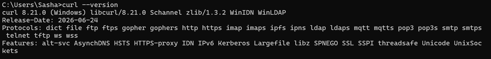

     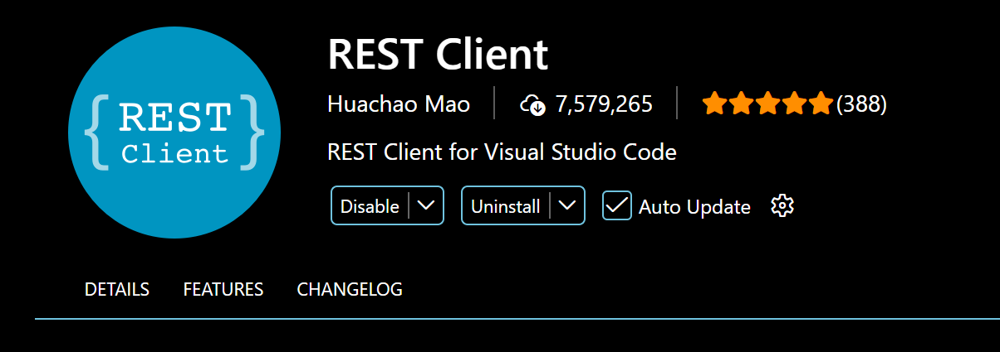

2. **Дослідження методів REST API в Postman:**
   - Виконати запит `GET https://dummyjson.com/products/1` — проаналізувати отримане тіло JSON, код статусу `200 OK`, час відповіді та розмір завантажених даних.

       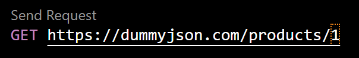
     
   - Виконати запит `POST https://dummyjson.com/products/add` — передати у тілі (Body -> raw JSON) об'єкт нового товару (поля `title`, `price`). Проаналізувати код статусу `201 Created` та отриманий згенерований `id`.
  
        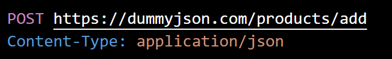

   - Виконати запит `PUT https://dummyjson.com/products/1` — надіслати змінене поле `title` та перевірити повернений результат.
  
        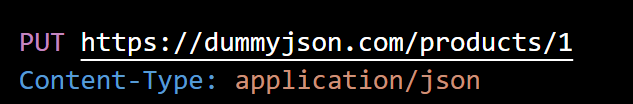

   - Виконати запит `DELETE https://dummyjson.com/products/1` — зафіксувати код статусу та наявність позначки видалення `isDeleted: true`.
  
      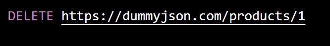

   - Зберегти створені запити у колекцію Postman (або у файл `requests.http`).

      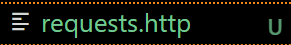

---

3. **Аналіз структури в DevTools:**
   - Відкрити у веббраузері адресу `https://dummyjson.com/products` із відкритою панеллю **DevTools (вкладка Network)**.
   - Знайти відповідний запит у списку мережевої активності та зафіксувати в окремій таблиці:
     - General: Request URL, Request Method, Status Code, Remote Address.
    
        | Секція / Категорія | Параметр / Заголовок | Значення |
        | :--- | :--- | :--- |
        | **General** | Request URL | `https://dummyjson.com/docs/products` |
        | | Request Method | `GET` |
        | | Status Code | `200 OK (from prefetch cache)` |
        | | Remote Address | `216.239.34.157:443` |
     - Response Headers: `content-type`, `date`, `server`, `etag`.
        | Секція / Категорія | Параметр / Заголовок | Значення |
        | :--- | :--- | :--- |
        | **Response Headers** | `content-type` | `text/html; charset=utf-8` |
        | | `date` | `Mon, 21 Sep 2026 11:26:54 GMT` |
        | | `server` | `cloudflare` |
        | | `etag` | *(відсутній у відповіді)* |

     - Request Headers: `accept`, `user-agent`, `accept-encoding`.
    
        | Секція / Категорія | Параметр / Заголовок | Значення |
        | :--- | :--- | :--- |
        | **Request Headers** | `accept` | *(Provisional headers are shown: відсутній у режимі prefetch cache)* |
        | | `user-agent` | `Mozilla/5.0 (Windows NT 10.0; Win64; x64) AppleWebKit/537.36 (KHTML, like Gecko) Chrome/153.0.0.0 Safari/537.36` |
        | | `accept-encoding` | *(Provisional headers are shown: відсутній у режимі prefetch cache)* |

     - Вкладку Timing: проаналізувати тривалість фаз DNS Lookup, Initial connection, Waiting for server response (TTFB), Content Download.

          | Секція / Категорія | Параметр / Заголовок | Значення |
          | :--- | :--- | :--- |
          | **General** | Request URL | `https://dummyjson.com/docs/products` |
          | | Request Method | `GET` |
          | | Status Code | `200 OK` |
          | | Remote Address | `216.239.34.157:443` |
          | **Response Headers** | `content-type` | `text/html; charset=utf-8` |
          | | `date` | `Mon, 21 Sep 2026 11:26:54 GMT` |
          | | `server` | `cloudflare` |
          | | `etag` | *(відсутній у відповіді)* |
          | **Request Headers** | `accept` | *(не зафіксовано / provisional)* |
          | | `user-agent` | `Mozilla/5.0 (Windows NT 10.0; Win64; x64) AppleWebKit/537.36 (KHTML, like Gecko) Chrome/153.0.0.0 Safari/537.36` |
          | | `accept-encoding` | *(не зафіксовано / provisional)* |
          | **Timing (фази)** | DNS Lookup | *(відсутній / 0 ms — використано існуюче DNS-з'єднання)* |
          | | Initial connection | `439.66 ms` |
          | | Waiting for server response (TTFB) | `239.94 ms` |
          | | Content Download | `0.95 ms` |
        ---
  ### Рівень 3. Просунутий: глибинний аналіз HTTPS/TLS, Cookie та CORS
  
  1. **Аналіз TLS Handshake через детальне трасування:**
     - Виконати запит `curl -v https://dummyjson.com/products/1`.
     - Зафіксувати у звіті та розібрати ключові етапи узгодження:
       - Встановлення TCP-з'єднання з IP-адресою та портом 443;
       - Відправлення `ClientHello` та отримання `ServerHello`;
       - Перевірка сертифіката (видавець CA, термін дії, Subject Alternative Name);
       - Узгоджений шифронабір (Cipher Suite) та протокол (наприклад, TLSv1.3 або TLSv1.2).
      
        | Категорія | Параметр / Заголовок | Значення з логу | Опис / Пояснення |
        | :--- | :--- | :--- | :--- |
        | **TCP Connection** | Remote IP & Port | `172.67.205.42:443` | Встановлено TCP-з'єднання з IP-адресою сервера на порт 443. |
        | | Local IP & Port | `192.168.0.107:55520` | Локальна IP-адреса та порт клієнта. |
        | **TLS / SSL Handshake** | SSL Engine | `schannel` | Використано системну бібліотеку Windows Schannel для TLS. |
        | | ALPN Protocol | `http/1.1` | Узгоджено протокол HTTP/1.1 для передачі даних. |
        | | SSL Connection | `SSL/TLS connection renegotiated` | Успішно виконано рукостискання та зашифровано канал. |
        | **Request Headers** | Request Line | `GET /products/1 HTTP/1.1` | Надіслано GET-запит на ендпоінт `/products/1`. |
        | | `Host` | `dummyjson.com` | Доменне ім'я цільового сервера. |
        | | `User-Agent` | `curl/8.21.0` | Ідентифікатор клієнта curl. |
        | | `Accept` | `*/*` | Клієнт приймає будь-який тип відповіді. |
        | **Response General** | Status Code | `200 OK` | Запит успішно виконано сервером. |
        | | Server | `cloudflare` | Захист та проксіювання здійснюється Cloudflare. |
        | **Response Headers** | `content-type` | `application/json; charset=utf-8` | Формат відповіді — JSON у кодуванні UTF-8. |
        | | `date` | `Mon, 21 Sep 2026 12:44:10 GMT` | Точний час відповіді сервера. |
        | | `etag` | `W/"5e6-LuZgXJ6APIKHswyRKC9GQ6dXUNE"` | Валідатор кЕшу для перевірки змін ресурсу. |
        | | `strict-transport-security` | `max-age=15552000; includeSubDomains` | HSTS заголовок (примусовий HTTPS на 180 днів). |
        | | `cache-control` | `no-store` | Заборона збереження відповіді в кЕші. |
        | | `cf-cache-status` | `HIT` | Відповідь віддана з Edge-кЕшу Cloudflare. |

         
        
     - Порівняти поведінку при примусовому зверненні через незахищений протокол HTTP:
       - Виконати `curl -I http://dummyjson.com/products/1`.
       - Зафіксувати повернений статус перенаправлення `301 Moved Permanently` або `308 Permanent Redirect` та наявність заголовка `Location: https://...`.

        | Параметр / Заголовок | Значення з логу | Опис / Пояснення |
        | :--- | :--- | :--- |
        | **Request Command** | `curl -I http://dummyjson.com/products/1` | Запит заголовків (HEAD) через незахищений протокол HTTP. |
        | **Status Code** | `HTTP/1.1 301 Moved Permanently` | Статус-код постійного перенаправлення на нову адресу. |
        | **Location** | `https://dummyjson.com/products/1` | Цільовий URL, на який сервер примусово перенаправляє клієнта (HTTPS). |
        | **Content-Type** | `text/html; charset=UTF-8` | Тип вмісту сторінки редіректу. |
        | **Date** | `Mon, 21 Sep 2026 12:51:12 GMT` | Точний час відповіді сервера. |
        | **Server** | `cloudflare` | Вебсервер / мережа доставки вмісту Cloudflare. |
        | **Connection** | `keep-alive` | Підтримка постійного з'єднання для подальших запитів. |

         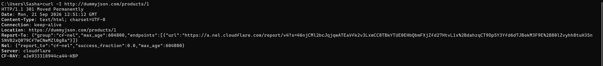
  
  1. **Дослідження життєвого циклу `Cookie` через Cookie Jar:**
     - Надіслати запит до `https://httpbin.org/cookies/set?user_role=student&session_key=lab1_token` із збереженням отриманих cookies у файл за допомогою прапорця `-c cookies.txt`.
     - Дослідити вміст згенерованого текстового файлу `cookies.txt` (формат Netscape cookie: домен, прапорець захищеності, шлях, термін життя, ім'я та значення).
       
       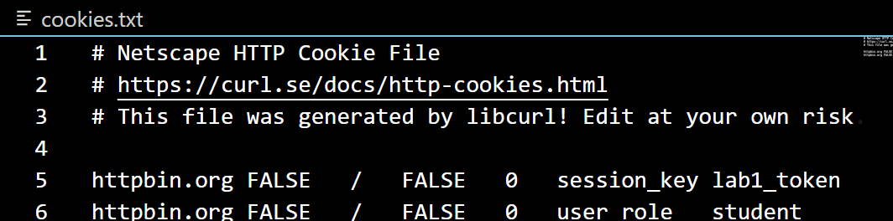
       
     - Здійснити повторний запит до ендпоінта перевірки `https://httpbin.org/cookies`, передавши збережені cookies за допомогою прапорця `-b cookies.txt`. Переконатися, що сервер розпізнав надіслані cookies у тілі відповіді.

       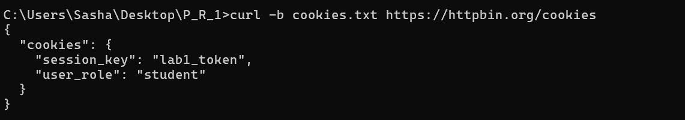
  
  2. **Аналіз заголовків безпеки Cookie:**
     - Надіслати запит до `https://httpbin.org/response-headers` із передачею кастомного заголовка `Set-Cookie` через query-параметри:
       - Параметр: `Set-Cookie=session_id=xyz789;%20Path=/;%20Secure;%20HttpOnly;%20SameSite=Strict`
     - Перевірити наявність та значення атрибутів `HttpOnly`, `Secure` і `SameSite` у відповіді через `curl -i`.
     - Пояснити у звіті, від яких саме векторів атак захищає кожен із цих атрибутів.

      | Параметр / Заголовок | Значення з логу | Опис / Пояснення |
      | :--- | :--- | :--- |
      | **Request Command** | `curl -i "https://httpbin.org/response-headers?Set-Cookie=session_id=xyz789;%20Path=/;%20Secure;%20HttpOnly;%20SameSite=Strict"` | Запит для симуляції генерації заголовка `Set-Cookie` сервером. |
      | **Status Code** | `HTTP/1.1 200 OK` | Запит успішно виконано. |
      | **Date** | `Mon, 21 Sep 2026 13:02:43 GMT` | Точний час відповіді сервера. |
      | **Content-Type** | `application/json` | Формат даних відповіді. |
      | **Server** | `gunicorn/19.9.0` | Вебсервер, на якому запущено httpbin. |
      | **Set-Cookie** | `session_id=xyz789; Path=/; Secure; HttpOnly; SameSite=Strict` | Інструкція браузеру зберегти cookie `session_id` із вказаними атрибутами безпеки. |
      | **`Path=/`** | `/` | Cookie дійсна для всіх маршрутів домену. |
      | **`Secure`** | *Присутній* | Передача cookie дозволена виключно через HTTPS. |
      | **`HttpOnly`** | *Присутній* | Заборона доступу до cookie через JavaScript (`document.cookie`). |
      | **`SameSite`** | `Strict` | Повне блокування передачі cookie при міжсайтових запитах. |
      | **Access-Control-Allow-Origin** | `*` | Дозвіл крос-доменних запитів з будь-якого Origin. |
      | **Access-Control-Allow-Credentials**| `true` | Дозвіл передавати учетні дані (cookies/auth headers) при CORS. |

       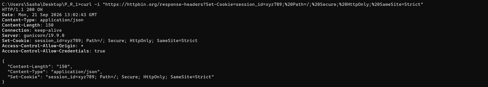
     
  4. **Симуляція перевірки політики CORS (Preflight Request):**
     - Використовуючи `curl`, симулювати попередній запит браузера методом `OPTIONS` до ресурсу `https://httpbin.org/post` (або `https://dummyjson.com/products/add`), передавши заголовки:
       - `-H "Origin: https://my-college-app.edu"`
       - `-H "Access-Control-Request-Method: POST"`
       - `-H "Access-Control-Request-Headers: Content-Type, Authorization"`
     - Проаналізувати заголовки відповіді сервера: чи присутні `Access-Control-Allow-Origin`, `Access-Control-Allow-Methods`, `Access-Control-Allow-Headers` та який статус повернув сервер (`200 OK` або `204 No Content`).

      | Параметр / Заголовок | Значення з логу | Опис / Пояснення |
      | :--- | :--- | :--- |
      | **Request Command** | `curl -i -X OPTIONS https://httpbin.org/post \` | Симуляція CORS Preflight (запит методом OPTIONS)[cite: 17]. |
      | **Status Code** | `HTTP/1.1 200 OK` | Сервер успішно обробив попередній запит перевірки[cite: 17]. |
      | **Date** | `Mon, 21 Sep 2026 13:04:50 GMT` | Точний час відповіді сервера[cite: 17]. |
      | **Content-Type** | `text/html; charset=utf-8` | Формат даних відповіді[cite: 17]. |
      | **Content-Length** | `0` | Тіло відповіді порожнє (стандартно для Preflight)[cite: 17]. |
      | **Server** | `gunicorn/19.9.0` | Вебсервер додатка[cite: 17]. |
      | **Allow** | `OPTIONS, POST` | HTTP-методи, які безпосередньо підтримує дане джерело[cite: 17]. |
      | **Access-Control-Allow-Origin** | `*` | Сервер дозволяє крос-доменні запити з будь-яких Origin[cite: 17]. |
      | **Access-Control-Allow-Credentials** | `true` | Дозвіл передавати учетні дані (cookies/auth headers) при CORS[cite: 17]. |
      | **Access-Control-Allow-Methods** | `GET, POST, PUT, DELETE, PATCH, OPTIONS` | Перелік дозволених HTTP-методів для міжсайтових запитів[cite: 17]. |
      | **Access-Control-Max-Age** | `3600` | Час у секундах (1 година), протягом якого браузер може кЕшувати результати Preflight[cite: 17]. |

     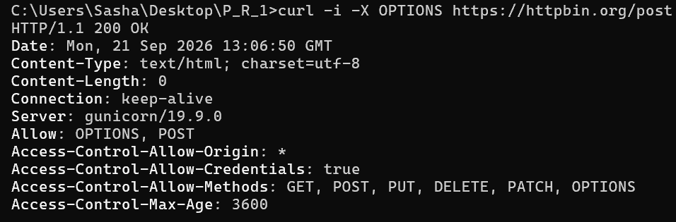
      
  ---


